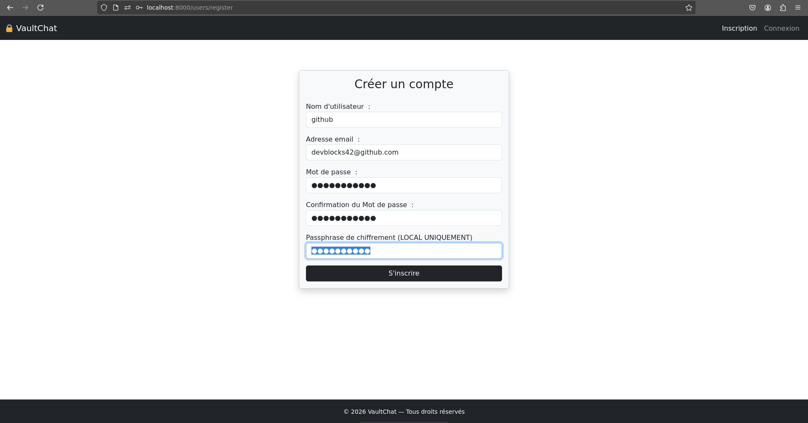
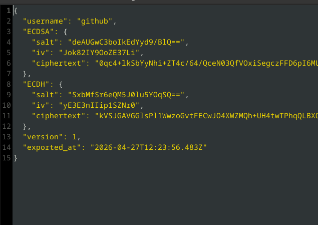
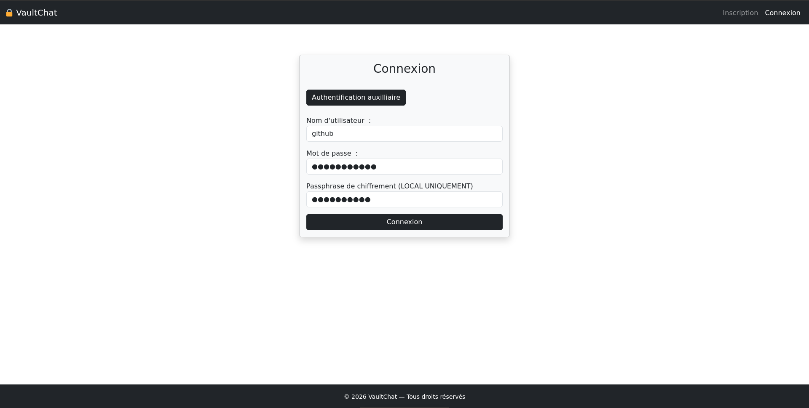
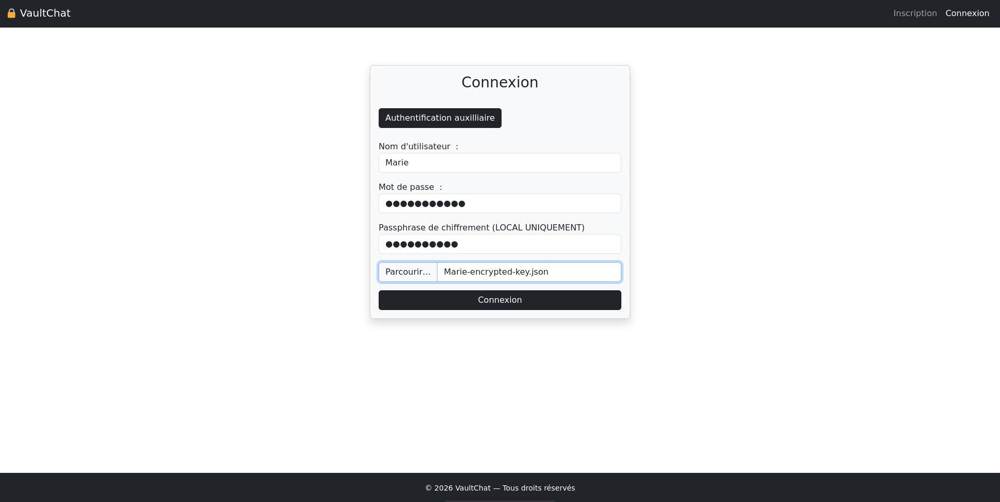
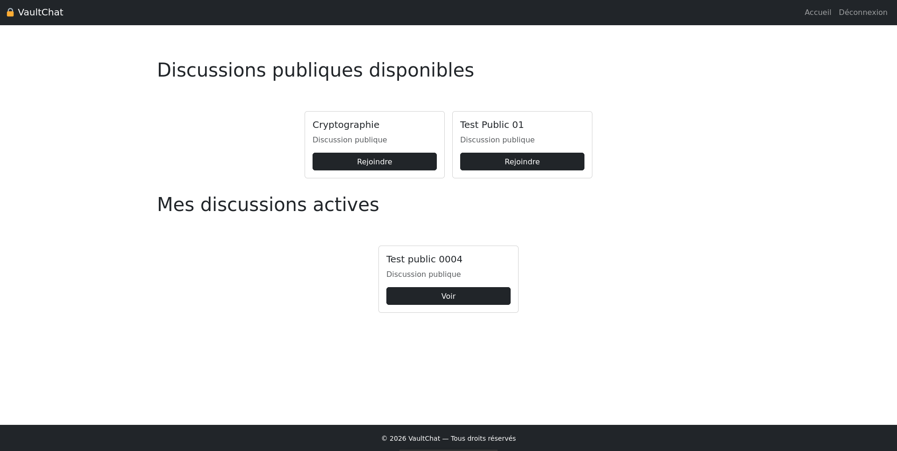
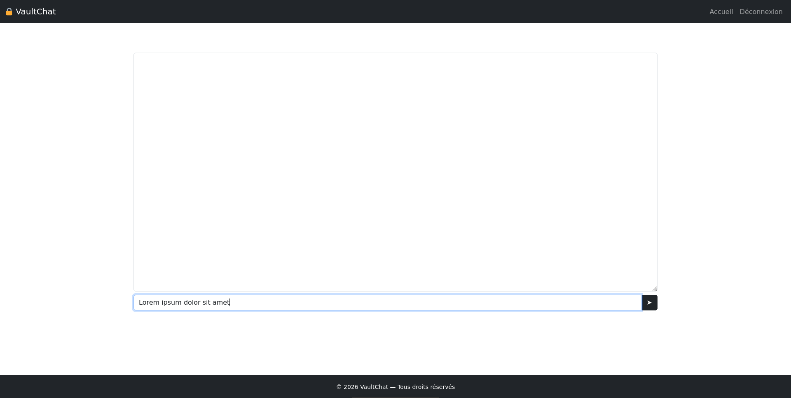

# VaultChat

**VaultChat** est une application web de messagerie cryptée en cours de développement, conçue selon une architecture **chiffrée de bout en bout (End To End Encryption)**, **zero-knowledge côté serveur (aucun accès au contenu en clair des messages)**, et assurant une **forward secrecy** par message via génération de clef éphémères.

---

# Objectif du projet

L’objectif de VaultChat est de permettre des échanges de messages privés où :

- le serveur ne peut pas lire le contenu des messages
- seuls les utilisateurs possèdent les clés de chiffrement
- la confidentialité est assurée même en cas de compromission du serveur
- résistance à certains scénarios de compromission du client, dépendant du stockage local des clés et de leur chiffrement

---

# Principes techniques

Le projet repose sur une conception cryptographique moderne :

- Une paire de clef **ECDSA (Elliptic Curve Digital Signature Algorithm )** long-terme pour l’authentification des utilisateurs (signature d’identité)
- Une paire de clef **ECDH (Elliptic-curve Diffie–Hellman)** permanente pour l'établissement de secrets partagés entre utilisateurs.
- Génération de **clefs éphémères ECDH** pour le chiffrement de chaque message (forward secrecy par message).
- Le serveur n'est qu'un relai de ciphertext, aucune clef privée n'est stockée.
- Stockage des clés privées chiffrées côté client uniquement (IndexedDB / Fichier de restauration) 

---

# Architecture globale

- **Backend (Django)** :
  - gestion des utilisateurs
  - gestion des chats et des messages chiffrés
  - stockage des clés publiques uniquement
  - aucune capacité de déchiffrement

- **Frontend (JavaScript)** :
  - génération et gestion des clés cryptographiques
  - chiffrement et déchiffrement des messages
  - stockage local sécurisé des secrets (IndexedDB ou Système de fichiers)

---


# Fonctionnalités développées 

- Inscription (Génération de clefs ECDSA + ECDH).
- Authentification (Django backend + signature de nonce via clef de signature).
- Création de discussion.
- Participation à une discussion + contrôles d'accès.
- Envoi de messages chiffrés non signés (AES-GCM).
- Récéption des messages chiffrés, déchiffrement. 
- Modification des informations personnelles (pseudonyme, adresse email, mot de passe) en synchronisation avec le fichier de restauration.

---

# Fonctionnalités en attente

- Mécanisme de signature/vérification des messages.
- Pagination des messages (+ efficace pour les discussions verbeuses).
- Intégrer l'export des clefs permanentes dans un fichier chiffré, sur demande de l'utilisateur (déjà implémenté à l'inscription).


# Modèle conceptuel des données


<small>Conçu avec looping https://www.looping-mcd.fr/</small>


# Flux de chiffrement d'un message 

Note : on n'aborde pas encore la signature des messages pour simplifier le problème.


```
A souhaite discuter avec B, C, D ... Z dans une discussion D; 

A ouvre la discussion D : 

	A reçoit la clef publique ECDH de B, C, D, ... Z :
		
		A écrit un message plaintext déstiné à B, C, D, .... Z : 

			ciphertexts = []

			(ESK_A, EPK_A) = generateECDHKeyPair() // On génère une paire de clef ECDH éphémère

			Pour chaque destinataire :

				S = ECDH(ESK_A, destinataire.PK) // Calcul du secret partagé

				salt = hash(EPK_A || destinataire.PK) 

				K = HKDF(S, salt, info="VaultChat_Message") // Dérivation de clef

				nonce = secure_random(16) // 16 bytes (128 bits)

				MSG(n) = AES-ENCRYPT(K, plaintext, nonce) // Chiffrement du message via AES-GCM.

				ciphertexts <- MSG(n)   

		ENVOIE DE ciphertexts AU SERVEUR
```

---

# Flux de déchiffrement d'un message

```
Pseudo-Algorithme de déchiffrement : 

A ouvre la discussion D :
	
	A reçoit la clef publique ECDH de B, C, D, ... Z :

	ciphertexts <- get_ciphertexts_for_user(A) // Liste des ciphertexts destinés à l'utilisateur d'identité A

	plaintexts <- []	

	Pour chaque ciphertext dans ciphertexts faire :

		EPK = ciphertext.ephemeral_public_key
		nonce = ciphertext.nonce
		S = ECDH(SK_A, EPK) // Calcul du secret ECDH

		salt = hash(EPK || destinataire.PK) 

		// Dérivation du secret ECDH
		K = HKDF(input=S, salt=salt, info="VaultChat_Message")

		// Déchiffrement 
		plaintext = AES-DECRYPT(K, nonce, ciphertext.ciphertext)
		
		plaintexts <- plaintext
	
	Affichage de plaintexts dans le document
```


# Screens de l'existant 

<small>Enregistrement de compte</small>




<small>Aperçu du fichier de restauration crypté</small>




<small>Authentification (mot de passe + passphrase crypto)</small>



<small>Authentification auxiliaire (mot de passe + passphrase crypto + fichier d'authentification/restauration)</small>



<small>Index des discussions</small>



<small>Zone de discussion</small>


