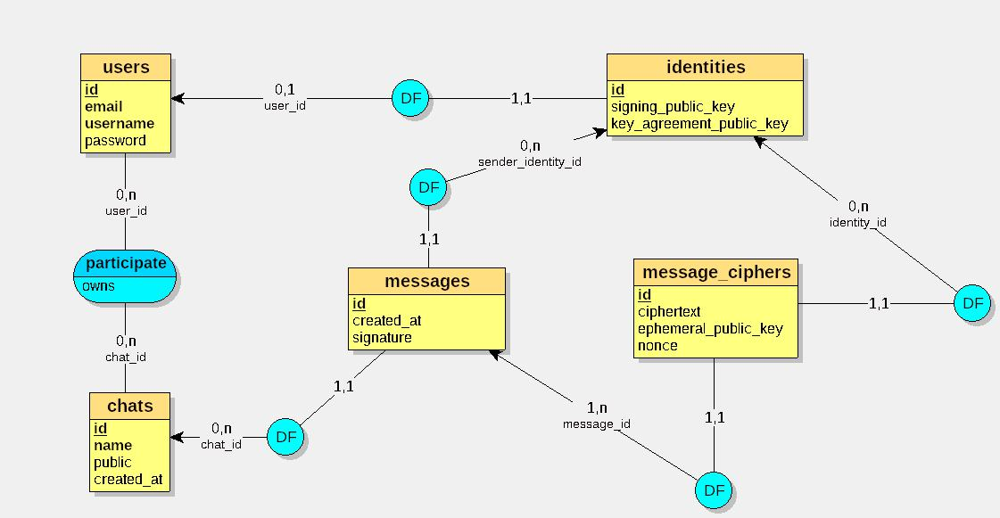

# VaultChat

**VaultChat** est une application web de messagerie sécurisée en cours de développement, conçue selon une architecture **chiffrée de bout en bout (E2EE)**, **zero-knowledge côté serveur (aucun accès au contenu des messages)**, et assurant une **forward secrecy** limitée aux sessions de login.

---

# Objectif du projet

L’objectif de VaultChat est de permettre des échanges de messages privés où :

- le serveur ne peut pas lire le contenu des messages
- seuls les utilisateurs possèdent les clés de chiffrement
- la confidentialité est assurée même en cas de compromission du serveur
- résistance limitée à certains scénarios de compromission du client, dépendant du stockage local des clés et de leur chiffrement

---

# Principes techniques

Le projet repose sur une conception cryptographique moderne :

- Une paire de clef **ECDSA (Elliptic Curve Digital Signature Algorithm )** long-terme pour l’authentification des utilisateurs (signature d’identité)
- Une paire de clef **X25519 ECDH (Elliptic-curve Diffie–Hellman)** permanente pour l'établissement de secrets partagés entre utilisateurs.
- ...
- Stockage des clés privées côté client uniquement (IndexedDB / Fichier de restauration) 

---

# Architecture globale

- **Backend (Django)** :
  - gestion des utilisateurs
  - gestion des chats et des messages chiffrés
  - stockage des clés publiques uniquement
  - aucune capacité de déchiffrement

- **Frontend (JavaScript)** :
  - génération et gestion des clés cryptographiques
  - chiffrement et déchiffrement des messages
  - stockage local sécurisé des secrets (IndexedDB ou Système de fichiers)

---

# Modèle conceptuel des données

<small>Conçu avec looping https://www.looping-mcd.fr/</small>

# Flux de chiffrement d'un message 

Note : on n'aborde pas encore la signature des messages pour simplifier le problème.

A souhaite discuter avec B, C, D ... Z dans une discussion D; 

A ouvre la discussion D : 

	A reçoit la clef publique ECDH de B, C, D, ... Z :
		
		A écrit un message M déstiné à B, C, D, .... Z : 

			A génère une paire de clefs éphémères ECDH notées ESK_A (clef privée éphémère ECDH de A); EPK_A (clef publique ECDH de A)

			(ESK_A, EPK_A) = generateECDHKeyPair()

			ciphertexts = []

			Pour chaque destinataire :

				S = ECDH(ESK_A, destinataire.PK) // Calcul du secret partagé

				salt = hash(EPK_A || destinataire.PK) 

				K = HKDF(S, salt, info="VaultChat_Message") // Dérivation de clef

				nonce = secure_random(16) // 16 bytes (128 bits)

				MSG(n) = AES-ENCRYPT(K, M, nonce) // Chiffrement du message via AES-GCM.

				ciphertexts <- MSG(n)   

		ENVOIE DE ciphertexts AU SERVEUR